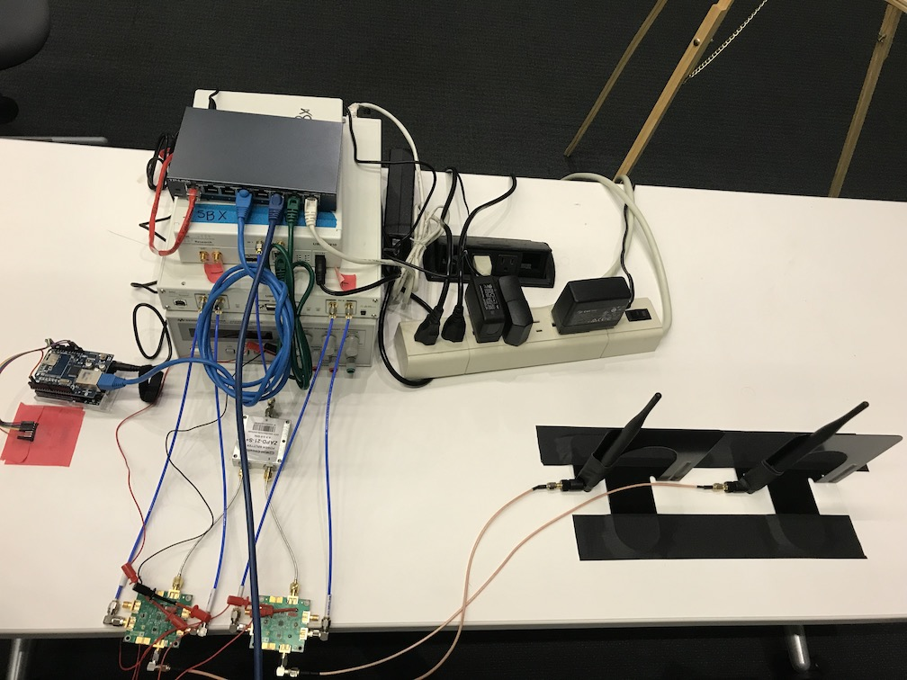
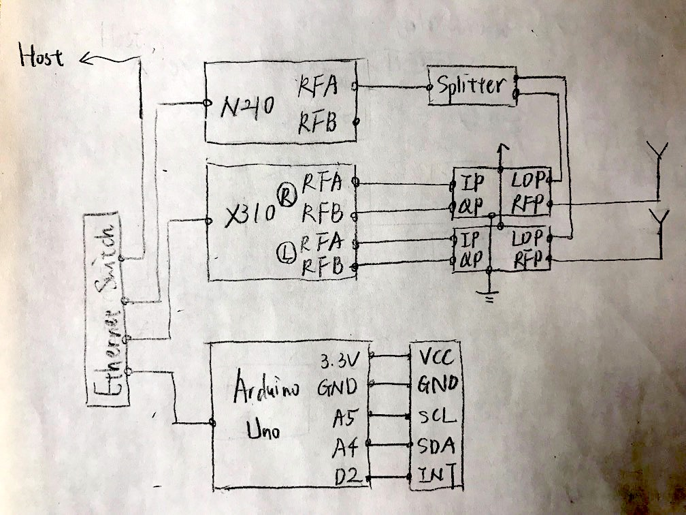

# LTElepathy: Realtime LTE Localization Toolbox

## Hardware
0. Arduino
	0. Arduino UNO
	0. Ethernet shield
	0. MPU-6050
		The wiring of MPU-6050 is
        0. `VCC -> 3.3V`
        0. `GND -> GND`
        0. `SCL -> A5`
        0. `SDA -> A4`
        0. `INT -> D2`
0. UE
	0. 1x USRP-X310 with two LFRX daughterboards
    0. 1x USRP-N210 with SBX daughterboard
    0. Two demodulators and a power splitter
0. Simulated eNodeB
	0. 1x USRP-X310 with a UBX-160 daughterboard
0. Miscellaneous
	0. Ethernet switch
	0. Ethernet cables
	0. SMA cables
	0. Two line antennas

The whole setup should look like below.


The wire connections are described in the schematics below.


## Dependency
0. Master
	0. Python requirements
	
	```bash
    pip install -r ./master/requirements.txt
    ```

0. Slave - Arduino
	0. [Arduino IDE](https://github.com/arduino/Arduino)
	
	```bash
    ARDUINO_PATH=~/Arduino

    sudo apt-get install git make gcc ant openjdk-8-jdk
    git clone https://github.com/arduino/Arduino.git $ARDUINO_PATH

    cd $ARDUINO_PATH/build
    ant build
    ```
	0. [`i2cdevlib`](https://github.com/jrowberg/i2cdevlib) including `I2Cdev` and `MPU6050`
	
    ```bash
    git clone https://github.com/jrowberg/i2cdevlib.git
    cp -r ./i2cdevlib/Arduino/{I2Cdev,MPU6050} ~/Arduino/libraries
    ```
    0. Install slave Arduino program via USB
    
    ```bash
    $ARDUINO_PATH/build/linux/work/arduino --upload ./slave/Arduino/main.ino
    ```

0. Slave - UE
	0. [`uhd`](https://github.com/EttusResearch/uhd)
	0. [`srsLTE`](https://github.com/srsLTE/srsLTE) and build with slave USRP program
	
	```bash
    SRSLTE_PATH=~/srsLTE

	sudo apt-get install cmake libfftw3-dev libmbedtls-dev libboost-all-dev libconfig++-dev libsctp-dev
    git clone https://github.com/srsLTE/srsLTE.git $SRSLTE_PATH

    # add this toolbox
    mkdir $SRSLTE_PATH/signal-kinetics
    echo "add_subdirectory(signal-kinetics)" >> $SRSLTE_PATH/CMakeLists.txt
    mv ./slave/USRP/main.c $SRSLTE_PATH/signal-kinetics

    # build
    mkdir $SRSLTE_PATH/build && cd $SRSLTE_PATH/build && cmake .. && make
    ```

## Usage
0. Master
Run `./master/main.py` to start listening incoming TCP connections. Only when both Arduino and UE are connected it starts to run MCL algorithm. Usually you would want to reset the Arduino first, and wait for around 10 seconds before starting UE program since it takes around 10 seconds for the MPU to settle down to stable state.

0. Slave - Arduino
As soon as Arduino board starts/resets, it would try to connect to server via TCP, and we only need to reset Arduino as we start the experiment.

0. Slave - UE and simulated eNodeB
Run `./slave/USRP/run.sh` with proper parameters set as described below. In the script, we first `make` the slave USRP program
	0. `IS_CUSTOM`: `true` for our custom eNodeB, otherwise `false`
	0. `FREQ`: the frequency we are listening to. `739e6` for AT&T stations nearby, and you would probably want to use `915e6`, which is with in ISM band for custom eNodeB
